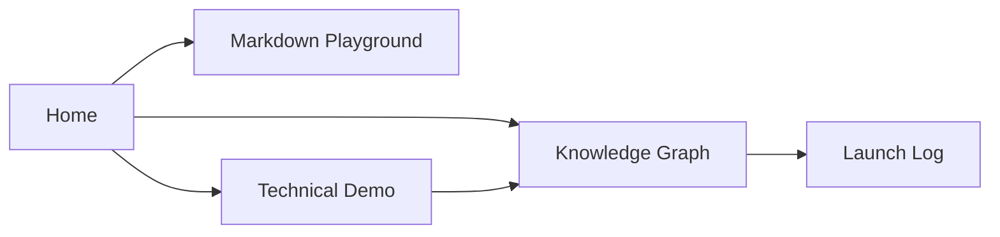

This note focuses on the heavier rendering paths: syntax highlighting, LaTeX, Mermaid, and a little inline HTML.

## Code Blocks

```ts
type DemoStatus = "draft" | "published"

interface DemoPage {
  slug: string
  status: DemoStatus
  links: string[]
}

const demo: DemoPage = {
  slug: "showcase/technical-demo",
  status: "published",
  links: ["showcase/markdown-playground", "showcase/knowledge-graph"],
}
```

```bash
npx quartz build --serve
```

```json
{
  "featureFlags": {
    "math": true,
    "mermaid": true,
    "wikilinks": true
  }
}
```

## Math and Diagrams

Inline math should work: $e^{i\pi} + 1 = 0$.

Block math should also render cleanly:

$$
\operatorname{score}(page) = \sum_{link \in backlinks(page)} \frac{1}{1 + depth(link)}
$$



## HTML Embed Surface

<details>
  <summary>Native HTML should pass through when it is safe</summary>
  <p>This is useful for disclosure widgets, badges, or one-off layout needs.</p>
</details>

For transclusion coverage, jump to [[showcase/knowledge-graph#Transclusions]].
